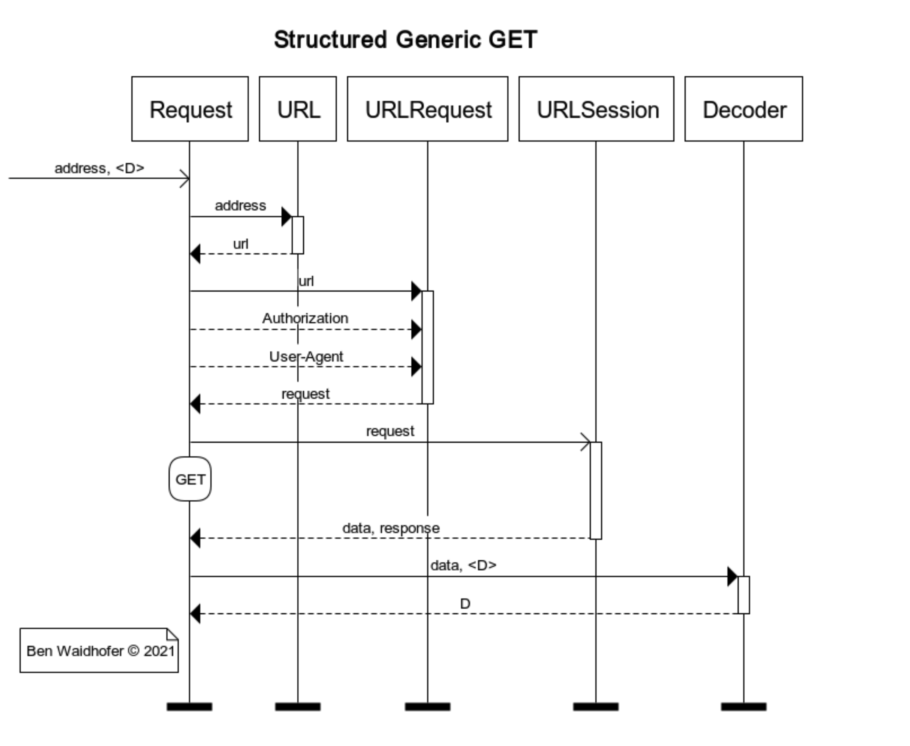
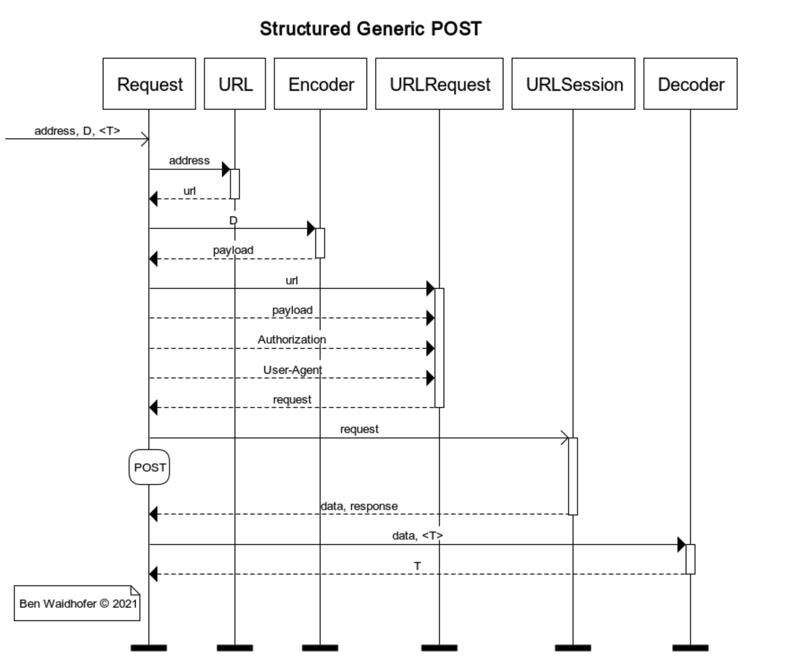

# CodableSession

Helper class that makes it easy to use a REST endpoint with Swift's structured concurrency and codables. There is an implentation for GET that takes an address and decodes the resulting json into a Swift struct. There is a POST implementation that sends an encodable and receives a decoable.

Wrapping all that functionality means the caller has to deal with a large range of possible errors and exceptions. To unify the error path a wrapper Error is used that transcodes framework errors and also generates new types of errors when needed.

See the included test for example codable structs and a couple of tests.

MIT License

Copyright (c) 2021 Ben Waidhofer

Awaitable REST access where the results are decoded into the type specified by the caller.

Caller passes in the codable object that is encoded into binary JSON and set as the http request's body. Results are decoded into the type specified by the caller.

